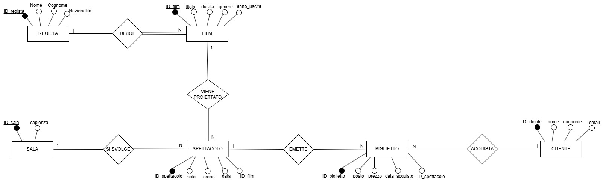
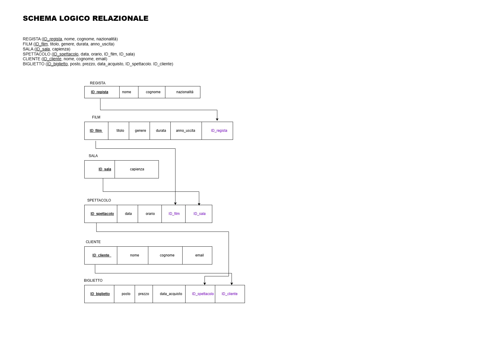
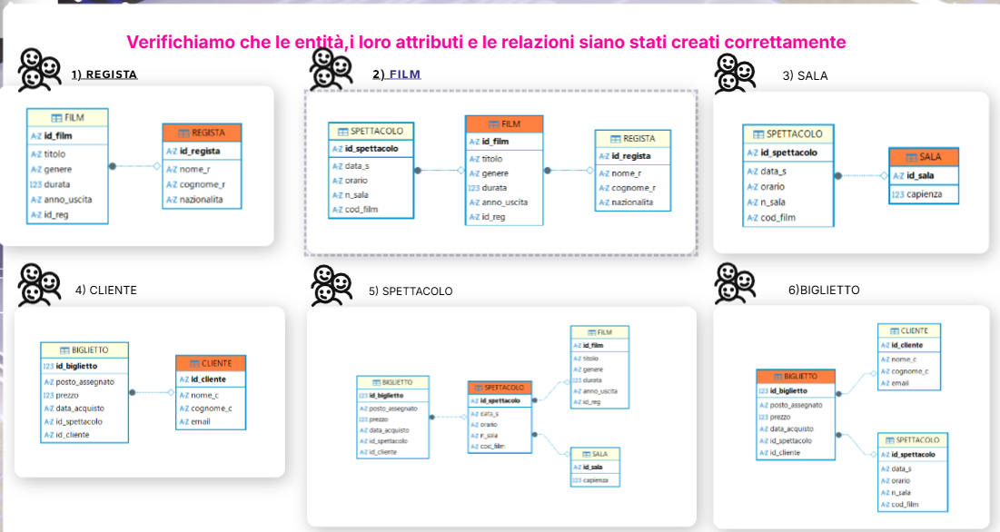
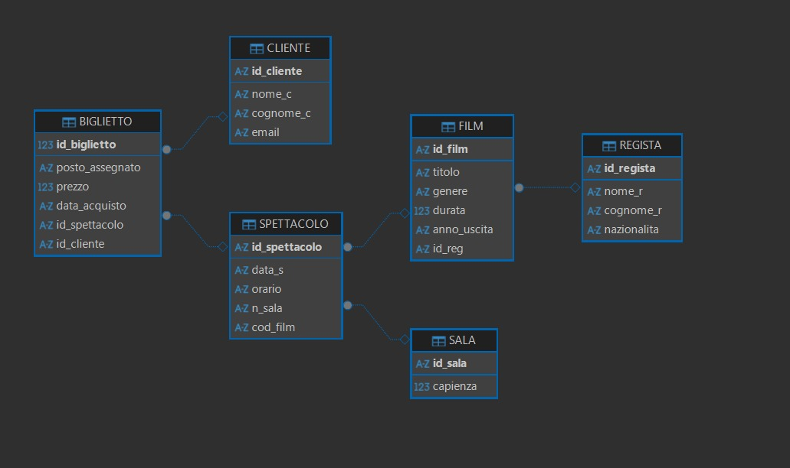
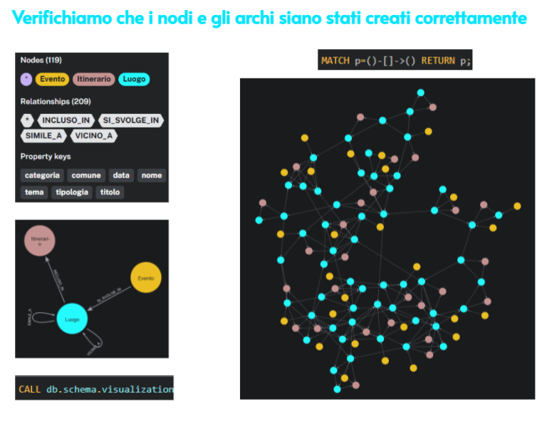

# Esame_Big_data 
## CINEMA MULTISALA
L'esercizio prevede la creazione di un DBMS (DataBase Management System) per l'organizzazione di un cinema.

Abbiamo scelto di utilizzare un database relazionale SQL, in quanto più idoneo a fornire una struttura coerente ai dati e alle relazioni previste.

Infatti i nostri dati sono rappresentati sotto forma di tabelle interconnesse tra loro, dunque si tratta di dati strutturati.

Come interfaccia per costruire questo DBSM usiamo DBeaver.

### Metodo:

1. Sono state create le tabelle relative alle entità, con i relativi attributi e chiavi (primarie ed esterne)
   - Script SQL 1: `creazione_tabelle.sql`

2. Successivamente sono state popolate tali tabelle
   - Script SQL 2: `popolamento_tabelle.sql`
   - Script SQL 3: `estensione_popolazione.sql`

3. È stato poi ricostruito l'intero percorso del film "Guida galattica per autostoppisti" per evidenziare la logica delle relazioni tra entità sulle slide
   - Script SQL 4: `percorso-guida_galattica_per_autostoppisti.sql`

4. Sono state eseguite le 3 query:
   1. Elencare gli spettacoli programmati in una determinata data con film e sala
   2. Calcolare il numero di biglietti venduti per ciascun film
   3. Individuare, per ciascuna sala, il tasso di occupazione medio in base ai biglietti venduti e alla capienza
   - Script SQL 5: `SQL_DBeaver/Script-sql_5_query-esame.sql`

## dunque per l'esecuzione delle query sulla powershell è stato costruito il file sql.py

### immagini SQL

## TURISMO CULTURALE
L'esercizio prevede la progettazione di un sistema informativo per la valorizzazione del patrimonio culturale e turistico di un territorio.

Abbiamo scelto di implementare una soluzione basata su un database a grafo utilizzando Neo4j, in quanto la struttura delle relazioni tra luoghi, eventi e itinerari è naturalmente complessa e multidimensionale.

## Metodo:
1) sono stati definiti i nodi (luoghi, itinerari ed eventi) e gli archi (relazioni di : INCLUSO_IN, SI_SVOLGE_IN, VICINO_A, SIMILE_A)
2) è stato verificato che i nodi e gli archi siano stati creati correttamente
3) sono eseguite le 3 query:
-1- trovare tutti i luoghi collegati a un certo itinerario tematico
-2- individuare eventi che si svolgono in luoghi vicini tra loro o appartenenti allo stesso tema culturale
-3- individuare quali luoghi dello stesso itinerario sono maggiormente connessi al altri luoghi per vicinanza o similarità tematica 

### immagine grafo

## anche in questo caso, per l'esecuzione delle query sulla powershell è stato costruito il file neo4j_script.py

## CATALOGO VIDEOGIOCHI
 Per il terzo esercizio abbiamo scelto di sviluppare un catalogo di videogiochi utilizzando un approccio NoSQL Key Document.

Docker: lo abbiamo utilizzato per containerizzare l'ambiente, avviando i server di Elasticsearch e Kibana in modo isolato, replicabile e senza configurazioni software locali.

Elasticsearch: scelto perché, a differenza dei database relazionali tradizionali, memorizza i dati in formato JSON (documenti flessibili e non strutturati) ed è un motore di ricerca ultra-rapido.

Kibana Dev Tools: utilizzato come console nativa per interagire direttamente con il database, permettendoci di inserire un dataset massiccio (60 videogiochi) ed eseguire query di prova in tempo reale.

## Metodo:
1) è stato costruito un catalogo contenente 60 videogiochi
2) sono state eseguite 2 query:
-1- trovare tutti i videogiochi che contengono la parola "mondo" nella descrizione 
-2- cercare tutti i videogiochi che appartengono al genere "RPG" e che costano meno di 40 euro

## per l'esecuzione delle query sulla powershell è stato costruito il file elastic.py
